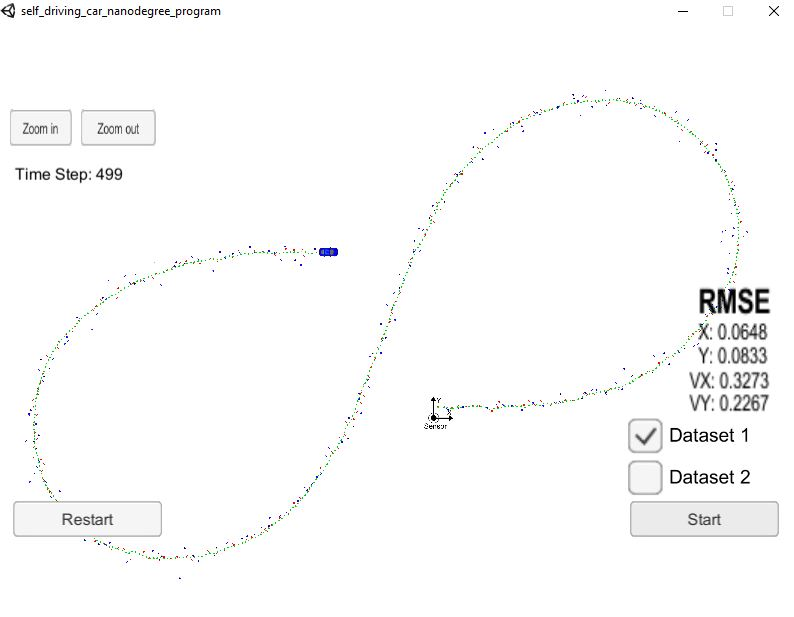
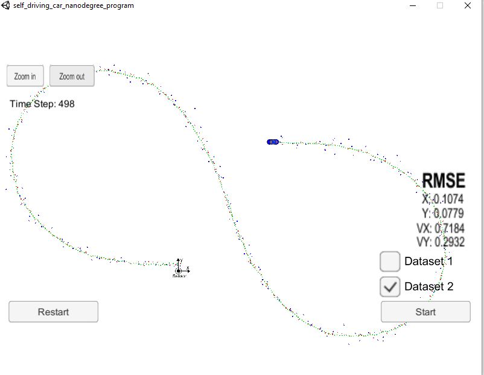
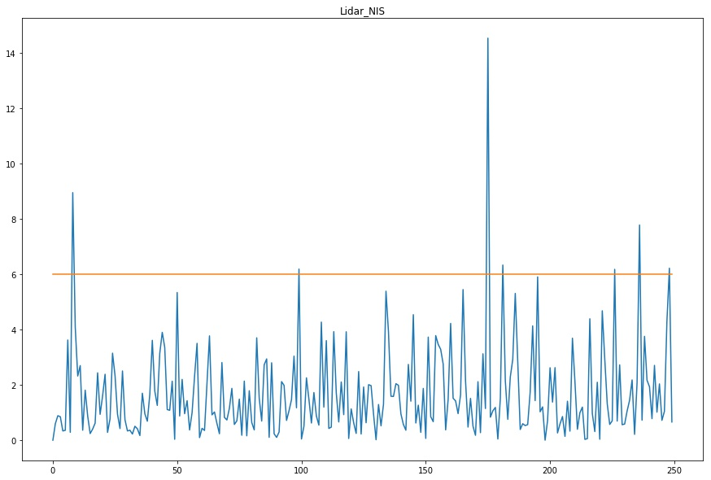

**Unscented Kalman Filter**
---

**Unscented Kalman Filter Project**

The goals of this project are the following:

* Implement the Unscented kalman filter algorithm
* Run the implemented algorithm on the simulator
* Summarize the results with a written report

## Project Basics
In this project, I used C++ to write a program taking in radar and lidar data to track position using Unscented Kalman Filters.

The code will make a prediction based on the sensor measurement and then update the expected position. See files in the 'src' folder for the primary C++ files making up this project.
---
### The results

#### 1. Running the algorithm on dataset1

| Input |   RMSE   |
| ----- | ------- |
|  px   | 0.0717 |
|  py   | 0.0835 |
|  vx   | 0.3486 |
|  vy   | 0.3228 |

#### 2. Running the algorithm on dataset2

| Input |   RMSE   |
| ----- | ------- |
|  px   | 0.0771 |
|  py   | 0.0818 |
|  vx   | 0.5394 |
|  vy   | 0.2619 |

#### 3. Consistency check
I checked the NIS values to tune the parameters until I reached to these values:

